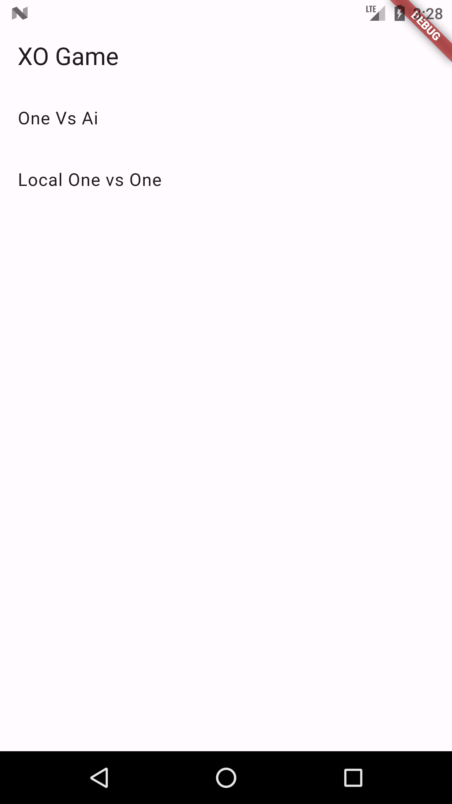
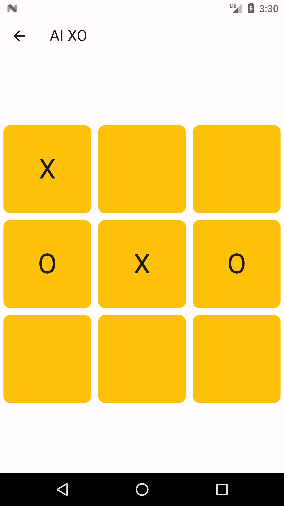
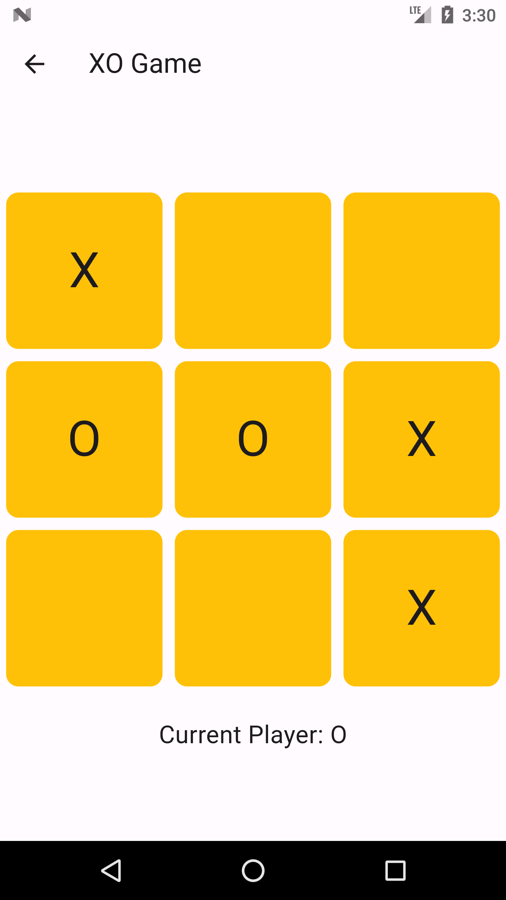

# XO Game

XO Game is a simple Tic-Tac-Toe game built with Flutter.

## Features

- Play against an AI opponent.
- Simple and intuitive user interface.
- Responsive design for various screen sizes.

## Screenshots
  


## Getting Started

To run the app locally on your machine, follow these steps:

1. Ensure you have Flutter installed. If not, you can follow the instructions [here](https://flutter.dev/docs/get-started/install).
2. Clone this repository:

   ```bash
   git clone https://github.com/your_username/xo_game.git
